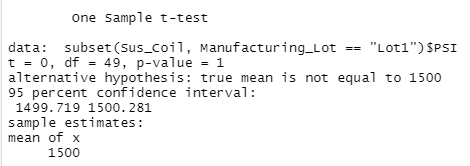

# MechaCar_Statistical_Analysis

## Linear Regression to Predict MPG

    -Which variables/coefficients provided a non-random amount of variance to the mpg values in the -   dataset?
        The ground_clearance and vehicle_length provided non-random amount of variance. Their Pvalues were less than 0.05.

    - Is the slope of the linear model considered to be zero? Why or why not?
        No. Because the p-value of our linear regression analysis is 5.35e-11. 

    - Does this linear model predict mpg of MechaCar prototypes effectively? Why or why not?
        Yes, because the R-squared is 71.5% correct prediction and the P-value is 5.35e-11 showing it is smaller than the regular .05% significance level. 
 

## Summary Statistics on Suspension Coils

Total Summary:

Lot Summary:

    The design specifications for the MechaCar suspension coils dictate that the variance of the suspension coils must not exceed 100 pounds per square inch (PSI). Does the current manufacturing data meet this design specification for all manufacturing lots in total and each lot individually? Why or why not?
        For all manufacturing lots in total yes they meet the design specification as depicted in the total summary table. The variance is 62.3. 
        For individual manufactures, only Lot3 did not meet the design specification. It exceeds by 70 per the Lot Summary image above. 

 ## T-Tests on Suspension Coils

Lot_1 t.test

Lot_2 t.test

Lot_3 t.test

 Testing the three lots per the larger population mean shows that lot 1 and 2 are not different from each other with their pvalues being greater than .05. Lot 3 is lower than .05 showing that it is different from the population mean of 1500PSI.
        

## Study Design: MechaCar vs Competition

To improve how a Mechacar would peform against the competitor, additional data regarding the safety of the car, how the vehicle does in different weather conditions, and noise level of the vehicle could be tested for. These are a few items that could appeal to a consumer. 
The null hypothesis is that these are no difference in their cars versus the competitor's. Would utilize multiple linear regression for prediction and utilize t.test to compare datasets. Data of sales and the measurements of crash tests and brakes systems, and noise levels of these cars would be required to completed analysis. 